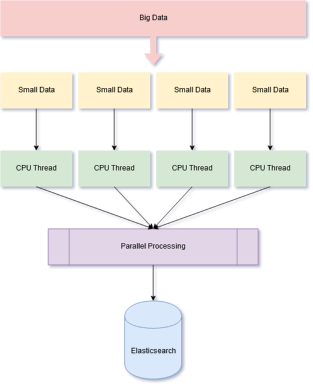
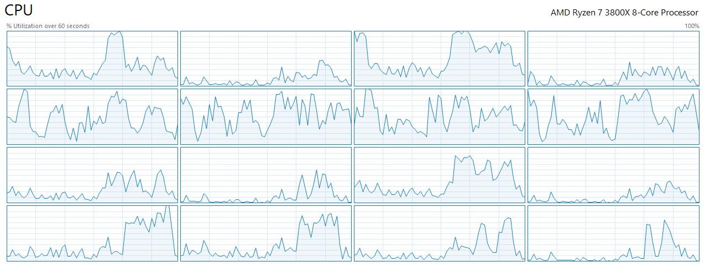

# ElasticSearch BigData importer

Imports raw JSON to Elasticsearch in a multi-thread way



We have 5 state here

- Only validating data
- Import data to ElasticSearch without validation
  - Import using single-thread
  - Import using multi-thread
- Import data to ElasticSearch after validation
  - Import using single-thread
  - Import using multi-thread

## Prerequisites

Install the elasticsearch package with [pip](https://pypi.python.org/pypi/elasticsearch) :

```bash
pip install elasticsearch
```

Read more about versions [here](https://github.com/elastic/elasticsearch-py#compatibility)

## Use

### Options

```
--data          : The data file
--check         : Validate data file
--bulk          : ElasticSearch endpoint ( http://localhost:9200 )
--index         : Index name
--type          : Index type
--import        : Import data to ES
--thread        : Threads amount, default = 1
--help          : Display help message
```

### Validate data

I suggest you check your data before ( or during ) import process

```bash
python import.py --data test_data.json --check
```

### Single Thread

##### Import without validation

```bash
python import.py --data test_data.json --import --bulk http://localhost:9200 --index index_name --type type_name
```

##### Import after validation

```bash
python import.py --data test_data.json --import --bulk http://localhost:9200 --index index_name --type type_name --check
```

### Multi Thread

##### Import without validation

```bash
python import.py --data test_data.json --import --bulk http://localhost:9200 --index index_name --type type_name --thread 16
```

##### Import after validation

```bash
python import.py --data test_data.json --import --bulk http://localhost:9200 --index index_name --type type_name --check --thread 16
```

---

We have much faster process using multi-thread way. It depends on your computer/server resources. This script used `linecache` to put data in RAM, so you need enough memory capacity too

## My test situation :

- AMD Ryzen 3800X ( 8 core / 16 thread )
- 64GB Ram ( 3000MHz / CL16 )
- Windows 10
- 10Gb JSON file with **~24 million** objects
- Elasticsearch v7

The whole process took about **~30 minutes** and the usage of resources were efficient


